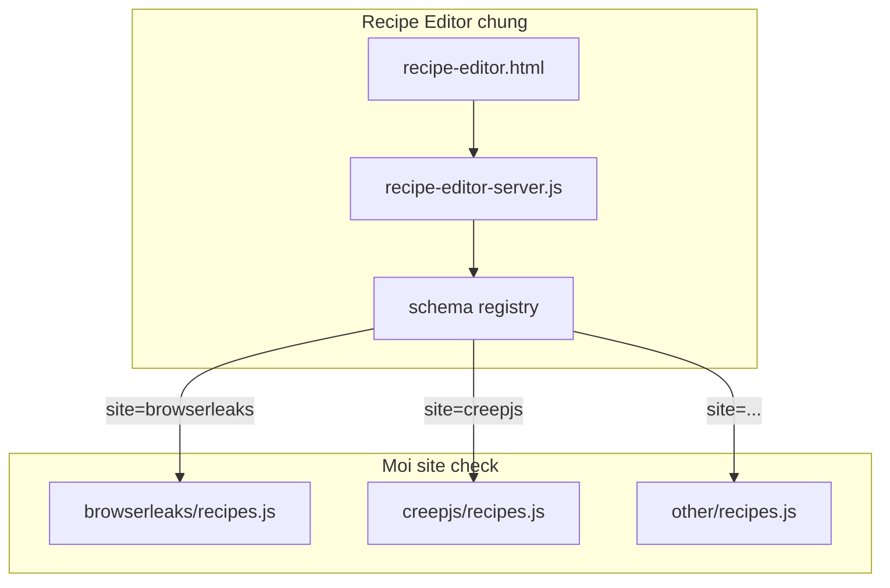

# Ý tưởng: Recipe Editor dùng chung (tách khỏi BrowserLeaks)

Phân tích refactor để `http://127.0.0.1:5179/recipes-config.html` trở thành **helper edit “code mẫu recipe”** — tái dùng khi viết script check trang khác (CreepJS, SannySoft, …), không copy HTML/server theo từng site.

---

## 1. Hiện trạng (vấn đề)

### Nguyên nhân

Editor đang **dính chặt BrowserLeaks**:

| Thành phần | Path | Coupling |
|------------|------|----------|
| UI | `checks/browserleaks/recipes-config.html` | Tab WebGL / WebGPU / JS battery hardcode |
| Server | `checks/browserleaks/recipes-config-server.js` | `RECIPES_PATH` cố định `recipes.js` |
| Schema save | `buildEditableBlock()` | Biết tên const: `WEBGL_PAGE_IDS`, `WEBGPU_*`, … |
| Runtime recipe | `checks/browserleaks/recipes.js` | Marker + helper scrape lẫn trong 1 file |

### Dẫn chứng

- Mở editor = luôn load BrowserLeaks; không chọn “site / recipe file”.
- Tab 6–8 chỉ có nghĩa với BrowserLeaks — CreepJS không cần.
- Phần **có thể tái dùng thật sự**: `PAGES`, `PAGE_OF`, `SECTION_OF`, `FIELD_OVERRIDE` (+ multi `sel` / `selMode`), Save theo marker, codegen JS literal.

### Cách khắc phục (hướng)

Tách **3 lớp**: schema chung · editor shell · adapter từng site.

---

## 2. Mục tiêu kiến trúc



- **Một** URL editor: `http://127.0.0.1:5179/?site=browserleaks`
- Chọn site → load schema → render tab động → Save chỉ khối `EDITABLE` của file recipe tương ứng.
- Runtime check vẫn: `require('./recipes')` + `selector.js` + `siteHighlight` (đã chung).

---

## 3. Contract “recipe module” dùng chung

Mọi `checks/<site>/recipes.js` nên theo khuôn:

```js
// === BEGIN EDITABLE CONFIG ===
const PAGES = { ... };
const PAGE_OF = { ... };           // optional
const SECTION_OF = { ... };        // optional
const FIELD_OVERRIDE = { ... };    // core: css|xpath|js|sel[]|tableCell
const SKIP_CHECKS = new Set([...]); // optional
// + site-specific editable (khai bao trong schema)
// === END EDITABLE CONFIG ===

// Runtime helpers — KHONG bi editor ghi de
function buildField(...) { ... }
module.exports = { PAGES, FIELD_OVERRIDE, fieldsForCheck, ... };
```

**Core fields** (mọi site đều có thể dùng):

| Key | Kiểu | Editor tab |
|-----|------|------------|
| `PAGES` | `{ [pageKey]: url }` | Pages |
| `PAGE_OF` | `{ [checkKey]: pageKey }` | Check → Page |
| `SECTION_OF` | `{ [checkKey]: { h3, h3Mode } }` | Section |
| `FIELD_OVERRIDE` | `{ [configKey]: override }` | Fields (multi-sel) |
| `SKIP_CHECKS` | `Set` / `string[]` | Skip |

**Site extras** (khai báo schema, không hardcode UI):

```js
// ví dụ browserleaks.schema.js
extras: [
  { key: 'WEBGL_PAGE_IDS', kind: 'stringSet', tab: 'WebGL whitelist' },
  { key: 'WEBGPU_PAGE_LIMITS', kind: 'stringSet', tab: 'WebGPU' },
  { key: 'WEBGL_PARAM_ID', kind: 'jsonObject', tab: 'WebGL map' },
]
```

CreepJS sau này có thể chỉ cần core + vài extra riêng, **không** inherit tab WebGPU.

---

## 4. Đề xuất cấu trúc thư mục

```
src/main/checks/
  _shared/                    # hoặc src/shared/recipeEditor/
    selector.js               # (đã có — chuyển dần từ browserleaks)
    siteHighlight.js          # (đã ở shared)
    recipeEditor/
      server.js               # port 5179, ?site=
      public/
        index.html            # shell
        editor.js
        editor.css
      schemas/
        browserleaks.js
        creepjs.js            # stub / tối giản
      codegen.js              # toJsLiteral, buildEditableBlock(schema, data)
      patchFile.js            # replace BEGIN/END marker

  browserleaks/
    recipes.js                # EDITABLE + helpers scrape
    index.js                  # runner
    cdp.js
    # XOA hoặc thin-wrapper: recipes-config.html/server → redirect sang _shared

  creepjs/
    recipes.js                # sau này
    index.js
```

`package.json`:

```json
"recipes:config": "node src/main/checks/_shared/recipeEditor/server.js"
```

URL:

- `http://127.0.0.1:5179/` → list site (từ `schemas/`)
- `http://127.0.0.1:5179/?site=browserleaks`

---

## 5. Schema API (server)

```http
GET  /api/sites
GET  /api/config?site=browserleaks
POST /api/save-config?site=browserleaks   body: { ...editable }
POST /api/preview-block?site=browserleaks
```

`GET /api/config` trả:

```json
{
  "site": "browserleaks",
  "schema": { "tabs": [...], "fields": [...] },
  "data": { "PAGES": {}, "FIELD_OVERRIDE": {}, ... }
}
```

UI **render tab theo `schema.tabs`**, không `if (site === 'browserleaks')` rải rác trong HTML.

---

## 6. Tách runtime recipe (quan trọng)

Hiện `recipes.js` BrowserLeaks = **data editable + scrapeWebGpuBundle + buildField** (~1100 dòng).

Nên tách dần:

| File | Nội dung |
|------|----------|
| `recipes.js` | Chỉ EDITABLE + `buildRecipes` / `fieldsForCheck` mỏng |
| `scrape.js` / giữ trong `index.js` | `scrapeWebGpuBundle`, bundle helpers |
| `selector.js` (shared) | Đã multi-sel |

Editor **chỉ đụng EDITABLE** — giữ nguyên nguyên tắc marker hiện tại (đúng hướng rồi).

---

## 7. Lộ trình đề xuất (không làm một phát)

### Phase 0 — giữ nguyên hành vi (đã gần xong)

- Marker BEGIN/END, Save không xoá helper.
- FIELD_OVERRIDE multi-sel + `selMode`.
- Doc này.

### Phase 1 — extract editor shell (ít rủi ro)

1. Move `recipes-config-server.js` + html → `checks/_shared/recipeEditor/`.
2. `?site=browserleaks` (default).
3. Schema file `schemas/browserleaks.js` mô tả đúng tab hiện tại.
4. Thin redirect / `npm run recipes:config` trỏ server mới.

### Phase 2 — generic tabs

1. Core tabs từ schema (Pages, PageOf, Section, Fields, Skip).
2. Extra tabs từ `schema.extras` (`stringSet` / `jsonObject` / `kv`).
3. Xoá hardcode WebGL khỏi HTML shell.

### Phase 3 — site thứ 2 (CreepJS)

1. `creepjs/recipes.js` với EDITABLE tối thiểu (`PAGES` + `FIELD_OVERRIDE`).
2. `schemas/creepjs.js`.
3. Runner CreepJS dùng `fieldsForCheck` + `siteHighlight.summarizeFieldResults` (đã có).

### Phase 4 — DX (tuỳ chọn)

- Preview diff trước Save.
- Validate selector syntax.
- Deep-link `?site=browserleaks&key=hidemium.webgpu.features`.

---

## 8. Việc **không** nên làm

- Copy `recipes-config.html` thành `creepjs-config.html`.
- Cho editor ghi đè cả file runtime (mất scrape helper).
- Nhét platformPolicy / OS vào recipe editor (OS là Settings app, khác layer).
- Schema JSON khổng lồ trong DB — file JS cạnh code là đủ.

---

## 9. Kết luận

| Câu hỏi | Trả lời |
|---------|---------|
| Editor có tiềm năng dùng chung? | **Có** — phần core PAGES / FIELD_OVERRIDE / multi-sel / marker Save đã là “recipe language”. |
| Điểm nghẽn? | UI + server hardcode BrowserLeaks extras; recipe file lẫn scrape. |
| Refactor tối thiểu có giá trị? | Phase 1: move + `?site=` + schema browserleaks = hành vi cũ, sẵn sàng site mới. |
| Khi làm CreepJS? | Thêm `recipes.js` + schema; tái dùng selector + siteHighlight; không viết editor mới. |

**Verdict:** Nên giữ và **tách dần** thành Recipe Editor chung theo schema — không vứt. Trước mắt BrowserLeaks vẫn là site đầu tiên; site sau chỉ thêm schema + file recipe, không fork HTML.
